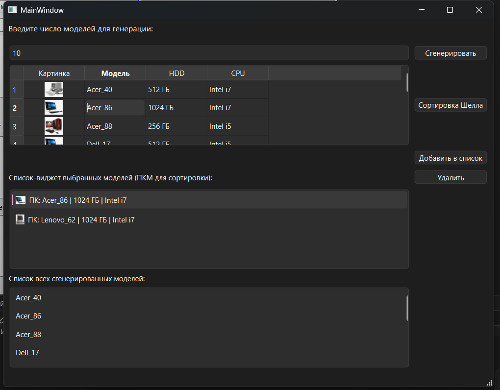

# Управление базой данных ПК на Qt 
#№ Задание №1 В7 (на С++ QT)
---

---
## Основные возможности
* Автоматическое заполнение базы данных уникальными ПК (модель, HDD, CPU, случайные иконки).
* Многоуровневая валидация (Активная блокировка ввода через `QIntValidator`, Пассивная проверка в коде на пустоту и переполнение памяти с выводом предупреждений через `QMessageBox`).
* Реализация нескольких виджетов:
  1. `QTableWidget`: Информативная интерактивная таблица со всеми характеристиками и изображениями.
  2. `QListWidget`: Персонализированная "Корзина" с иконками и **защитой от дубликатов** (учитывается совпадение модели, CPU и объема HDD).
  3. `QListView` + `QStringListModel`: Демонстрация паттерна **Model/View** для вывода чистого списка моделей.
* Сортировка Шелла с интеграцией `QCollator`.
---
## Инструкция по сборке и запуску

Для локального запуска проекта на вашем компьютере должны быть установлены **Qt Creator** и компилятор (**MinGW** или **MSVC**).

1. Склонируйте репозиторий:
   ```bash
   git clone [https://github.com/vorymu/practice_computers.git](https://github.com/vorymu/practice_computers.git)
2. Откройте файл проекта task1.pro в среде Qt Creator.
3. Запустите qmake (Сборка -> Запустить qmake), чтобы обновить ресурсы картинок.
4. Соберите и запустите проект (нажав на Зеленый треугольник или Ctrl + R).
